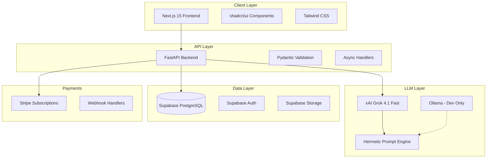
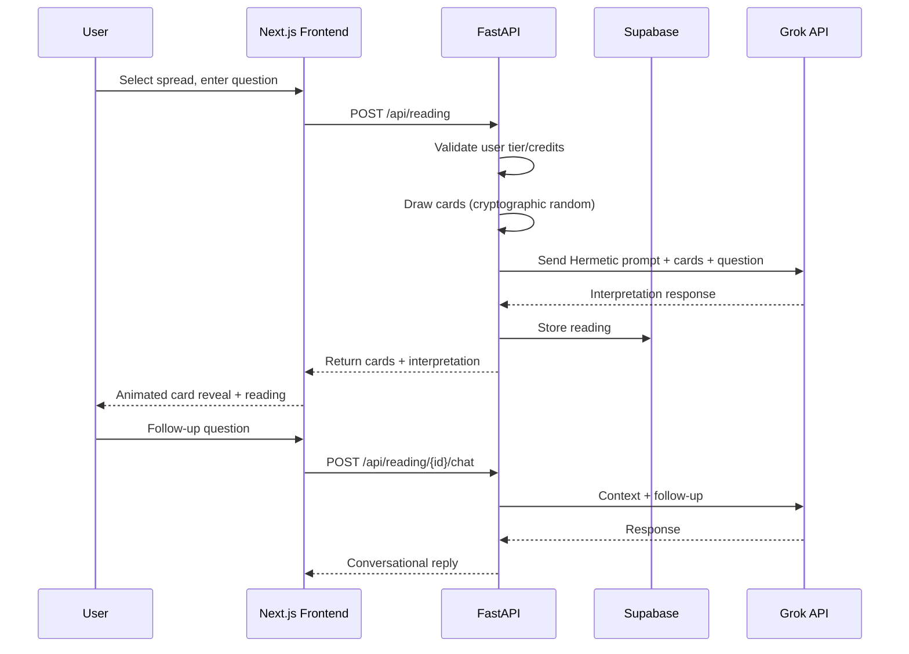
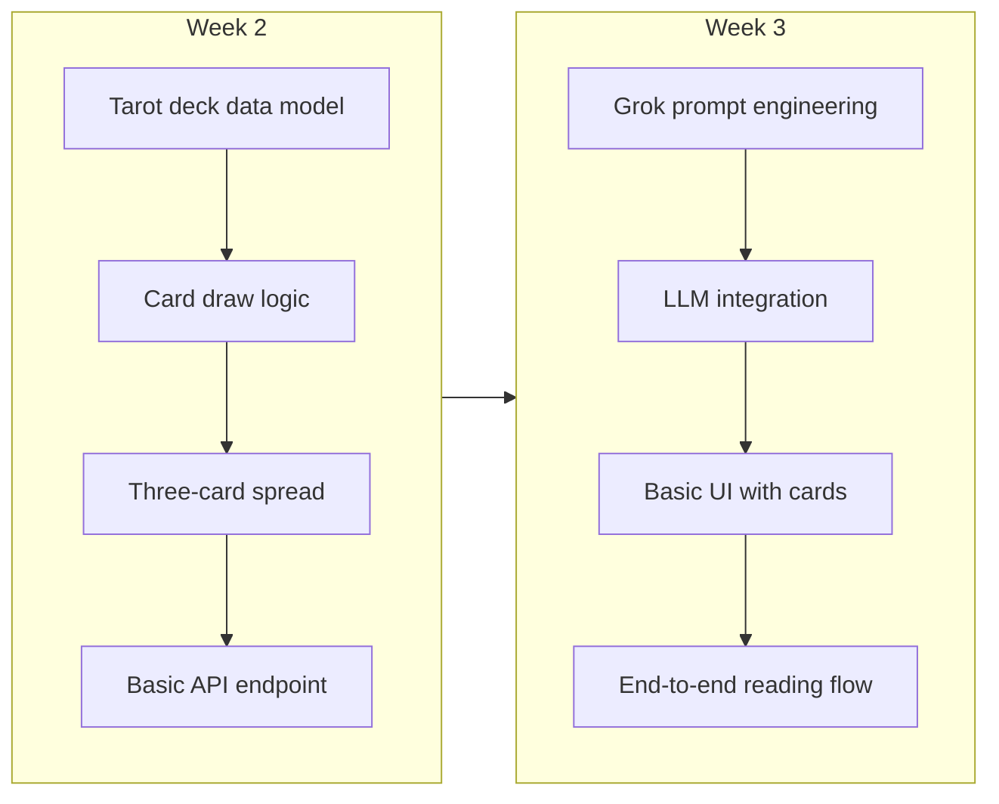
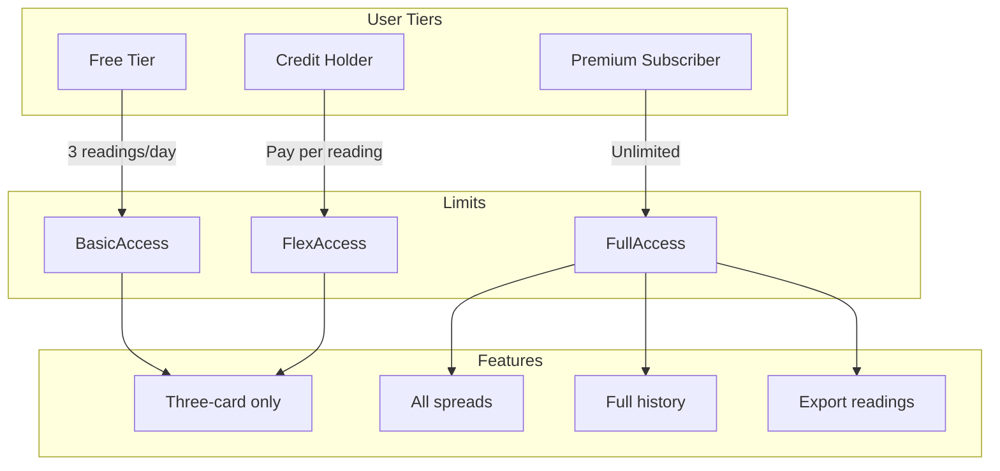
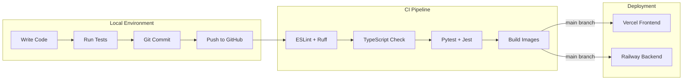
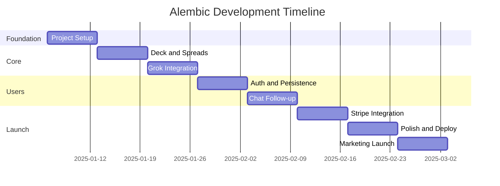

# Alembic: The Hermetic Tarot Mirror

## Project Vision

Alembic is an AI-powered tarot reading application rooted in Hermetic philosophy and depth psychology. Unlike surface-level tarot apps, Alembic serves as a **vessel of transformation** - a digital alembic where questions are transmuted into insight through the marriage of ancient symbolism and modern AI.

**Core Principle**: "As above, so below; as within, so without" - The Principle of Correspondence guides both the UX design and the interpretive framework.

---

## Part 1: Technical Architecture

### System Architecture Overview



### Data Flow: Reading Session



---

## Part 2: Stack Analysis and Comparison

### Frontend Framework Comparison

| Criterion | Next.js 15 | SvelteKit | Astro |
|-----------|------------|-----------|-------|
| Learning curve | Medium | Easy | Easy |
| Job market relevance | High | Medium | Low |
| SSR/SSG support | Excellent | Excellent | Excellent |
| AI tooling (v0, Cursor) | Best | Good | Limited |
| Component ecosystem | Massive | Growing | Limited |
| Performance | Very Good | Excellent | Excellent |
| Vercel integration | Native | Good | Good |

**Decision: Next.js 15**

Pros:

1. Best AI tooling support (v0.dev, Cursor, shadcn/ui)
2. Highest job market relevance for career growth
3. Native Vercel deployment with zero config
4. Server Components reduce client bundle
5. Massive ecosystem and community support
6. App Router provides modern patterns
7. Built-in image optimization for tarot cards
8. Excellent TypeScript support
9. React Server Actions simplify data mutations
10. Industry standard - transferable skills

Cons:

1. Steeper learning curve than Svelte
2. More boilerplate than simpler frameworks
3. React hydration can affect initial load
4. Frequent breaking changes between versions
5. Complex mental model (server vs client)

---

### Backend Framework Comparison

| Criterion | FastAPI | Next.js API Routes | Express |
|-----------|---------|-------------------|---------|
| Performance | Excellent | Good | Good |
| Type safety | Excellent | Good | Poor |
| Async support | Native | Native | Callback-based |
| OpenAPI docs | Automatic | Manual | Manual |
| Python ML ecosystem | Full access | None | None |
| Hosting options | Many | Vercel only | Many |

**Decision: FastAPI**

Pros:

1. Automatic OpenAPI documentation
2. Native async/await for LLM calls
3. Pydantic validation prevents bad data
4. Python ecosystem for future ML work
5. Easy integration with Grok/LiteLLM
6. Excellent performance (Starlette-based)
7. Dependency injection built-in
8. Type hints improve code quality
9. Railway deployment is straightforward
10. Career-relevant Python skills

Cons:

1. Separate deployment from frontend
2. CORS configuration required
3. Two languages in stack (Python + TypeScript)
4. Cold starts on serverless platforms
5. Less mature than Django/Flask ecosystem

---

### Database Comparison

| Criterion | Supabase | Neon | PlanetScale |
|-----------|----------|------|-------------|
| Database type | PostgreSQL | PostgreSQL | MySQL (Vitess) |
| Auth included | Yes | No | No |
| Storage included | Yes | No | No |
| Free tier | Generous | Generous | Limited |
| Branching | Yes | Yes | Yes |
| Real-time | Yes | No | No |
| Edge functions | Yes | No | No |

**Decision: Supabase**

Pros:

1. All-in-one: DB + Auth + Storage + Edge Functions
2. PostgreSQL with full feature support
3. Row Level Security for data protection
4. Real-time subscriptions if needed later
5. Generous free tier (500MB, 50K MAU)
6. Built-in auth with social providers
7. Auto-generated REST and GraphQL APIs
8. Good Next.js integration
9. Open source - can self-host
10. Active development and community

Cons:

1. Vendor lock-in for full stack features
2. PostgreSQL scaling requires planning
3. No branch merging support
4. Edge functions still maturing
5. Can be overkill for simple apps

---

### LLM Provider Comparison

| Criterion | Grok 4.1 Fast | Claude 4 Sonnet | GPT-4o |
|-----------|---------------|-----------------|--------|
| Input cost (per 1M) | $0.20 | $3.00 | $2.50 |
| Output cost (per 1M) | $0.50 | $15.00 | $10.00 |
| Context window | 2M tokens | 200K tokens | 128K tokens |
| Personality | Edgy, direct | Thoughtful, nuanced | Balanced |
| API stability | Good | Excellent | Excellent |

**Decision: Grok 4.1 Fast (Primary), Ollama (Development)**

Pros:

1. 10-15x cheaper than Claude/GPT-4
2. 2M token context for long readings
3. Distinctive personality suits tarot
4. xAI actively developing
5. Good reasoning capabilities
6. Fast response times
7. Works well with LiteLLM
8. Real-time knowledge (via X integration)
9. Less "corporate" voice than competitors
10. Supports tool calling for future features

Cons:

1. Younger API, less battle-tested
2. Smaller community/fewer examples
3. May have availability issues
4. Less refined safety filters
5. Documentation less comprehensive

---

## Part 3: Project Structure

```
/mnt/d/Projects/Alembic/
├── README.md
├── .cursor/
│   └── rules/
│       ├── alembic-context.mdc      # Project architecture context
│       ├── hermetic-voice.mdc       # Tone and language guide
│       ├── tarot-knowledge.mdc      # Tarot symbolism reference
│       └── stack.mdc                # Tech stack patterns
├── docs/
│   ├── architecture/
│   │   ├── system-overview.md
│   │   ├── data-model.md
│   │   └── api-design.md
│   ├── decisions/
│   │   ├── 001-stack-selection.md
│   │   ├── 002-llm-choice.md
│   │   └── 003-monetization.md
│   ├── guides/
│   │   ├── local-development.md
│   │   ├── deployment.md
│   │   └── stripe-setup.md
│   ├── prompts/
│   │   ├── system-prompt.md
│   │   ├── three-card-prompt.md
│   │   └── follow-up-prompt.md
│   └── tarot/
│       ├── major-arcana.md
│       ├── minor-arcana.md
│       └── spreads.md
├── obsidian/
│   ├── .obsidian/
│   ├── 00-inbox/
│   ├── 01-daily/
│   ├── 02-project/
│   │   ├── tasks.md
│   │   ├── kanban.md
│   │   └── milestones.md
│   ├── 03-knowledge/
│   │   ├── tarot/
│   │   └── hermetic/
│   └── 04-archive/
├── backend/
│   ├── alembic/                     # DB migrations (the tool, not project name)
│   ├── app/
│   │   ├── __init__.py
│   │   ├── main.py
│   │   ├── config.py
│   │   ├── api/
│   │   │   ├── __init__.py
│   │   │   ├── deps.py
│   │   │   └── routers/
│   │   │       ├── reading.py
│   │   │       ├── chat.py
│   │   │       ├── user.py
│   │   │       └── webhook.py
│   │   ├── core/
│   │   │   ├── tarot/
│   │   │   │   ├── deck.py
│   │   │   │   ├── spreads.py
│   │   │   │   └── cards.py
│   │   │   ├── llm/
│   │   │   │   ├── grok.py
│   │   │   │   └── prompts.py
│   │   │   └── services/
│   │   │       ├── reading.py
│   │   │       └── subscription.py
│   │   ├── models/
│   │   │   ├── user.py
│   │   │   ├── reading.py
│   │   │   └── subscription.py
│   │   └── schemas/
│   │       ├── reading.py
│   │       └── user.py
│   ├── tests/
│   ├── pyproject.toml
│   ├── Dockerfile
│   └── .env.example
├── frontend/
│   ├── src/
│   │   ├── app/
│   │   │   ├── layout.tsx
│   │   │   ├── page.tsx
│   │   │   ├── reading/
│   │   │   │   └── page.tsx
│   │   │   ├── history/
│   │   │   │   └── page.tsx
│   │   │   └── api/
│   │   │       └── webhook/
│   │   ├── components/
│   │   │   ├── ui/                  # shadcn components
│   │   │   ├── tarot/
│   │   │   │   ├── Card.tsx
│   │   │   │   ├── Spread.tsx
│   │   │   │   ├── DrawAnimation.tsx
│   │   │   │   └── Reading.tsx
│   │   │   └── layout/
│   │   ├── lib/
│   │   │   ├── api.ts
│   │   │   ├── supabase.ts
│   │   │   └── stripe.ts
│   │   └── styles/
│   ├── public/
│   │   └── cards/                   # Tarot card images
│   ├── package.json
│   ├── tailwind.config.ts
│   └── next.config.ts
├── infrastructure/
│   ├── docker-compose.yml           # Local development
│   └── railway.toml
└── scripts/
    ├── seed-cards.py
    └── test-prompts.py
```

---

## Part 4: Phased Implementation Plan

### Phase 0: Foundation (Week 1)

**Goal**: Project setup, tooling, and local development environment

| Task | Duration | Deliverable |
|------|----------|-------------|
| Create project structure | 2h | Folder structure created |
| Set up Obsidian vault with Kanban | 2h | Task management ready |
| Initialize Next.js 15 with shadcn/ui | 2h | Frontend scaffold |
| Initialize FastAPI backend | 2h | Backend scaffold |
| Configure local Ollama for dev | 1h | Free local LLM testing |
| Set up Supabase project | 1h | Database ready |
| Create Cursor rules | 2h | AI coding context |
| Document architecture decisions | 2h | ADRs written |

**Learning Focus**: Next.js App Router, FastAPI project structure

---

### Phase 1: Core Reading Flow (Weeks 2-3)

**Goal**: Working three-card reading with Grok interpretation



| Task | Duration | Deliverable |
|------|----------|-------------|
| Create 78-card deck data (JSON) | 4h | Complete deck with meanings |
| Implement card draw with crypto random | 2h | Fair, unpredictable draws |
| Build three-card spread logic | 2h | Past/Present/Future positions |
| Design Hermetic system prompt | 4h | Core interpretive voice |
| Integrate Grok via LiteLLM | 3h | Working LLM calls |
| Create reading API endpoint | 3h | POST /api/reading |
| Build card component with flip animation | 4h | Visual card reveal |
| Build spread layout component | 3h | Three-card display |
| Connect frontend to API | 2h | End-to-end flow |
| Test with 10+ readings | 2h | Quality validation |

**Learning Focus**: Prompt engineering, React animations, API design

---

### Phase 2: User System and Persistence (Week 4)

**Goal**: Authentication and reading history

| Task | Duration | Deliverable |
|------|----------|-------------|
| Configure Supabase Auth | 2h | Email + Google login |
| Create user profile table | 1h | Database schema |
| Create readings table | 2h | Store reading history |
| Build auth UI components | 3h | Login/signup forms |
| Implement protected routes | 2h | Require auth for readings |
| Build reading history page | 3h | View past readings |
| Add reading detail view | 2h | Revisit old readings |

**Learning Focus**: Supabase Auth, Row Level Security, Next.js middleware

---

### Phase 3: Conversational Follow-up (Week 5)

**Goal**: Chat about readings, deepen interpretation

| Task | Duration | Deliverable |
|------|----------|-------------|
| Design conversation data model | 1h | Messages schema |
| Create follow-up prompt template | 3h | Context-aware responses |
| Build chat API endpoint | 2h | POST /api/reading/{id}/chat |
| Create chat UI component | 4h | Message thread display |
| Implement streaming responses | 3h | Real-time text generation |
| Add conversation persistence | 2h | Save chat history |

**Learning Focus**: Server-Sent Events, streaming LLM responses

---

### Phase 4: Monetization (Week 6)

**Goal**: Stripe integration with hybrid model



| Task | Duration | Deliverable |
|------|----------|-------------|
| Set up Stripe account and products | 2h | Subscription plans created |
| Create subscription table | 1h | Track user subscriptions |
| Implement Stripe Checkout | 3h | Payment flow |
| Build webhook handler | 3h | Sync subscription status |
| Implement usage tracking | 2h | Count free tier readings |
| Create upgrade prompts | 2h | Conversion UI |
| Add credit purchase option | 3h | Alternative payment model |
| Test full payment flow | 2h | Verify all scenarios |

**Learning Focus**: Stripe webhooks, subscription lifecycle

---

### Phase 5: Polish and Launch Prep (Week 7)

**Goal**: Production-ready application

| Task | Duration | Deliverable |
|------|----------|-------------|
| Design landing page | 4h | Marketing homepage |
| Create card artwork sourcing plan | 2h | Legal, beautiful images |
| Implement SEO metadata | 2h | OpenGraph, structured data |
| Add error boundaries | 2h | Graceful error handling |
| Set up monitoring (Sentry) | 2h | Error tracking |
| Configure production environment | 2h | Vercel + Railway deployment |
| Write privacy policy and terms | 2h | Legal requirements |
| Create social sharing for readings | 2h | Viral growth feature |

**Learning Focus**: Production deployment, monitoring, legal compliance

---

### Phase 6: Launch and Marketing (Week 8)

**Goal**: Live product with initial users

| Task | Duration | Deliverable |
|------|----------|-------------|
| Deploy to production | 2h | Live application |
| Set up analytics (Plausible/PostHog) | 2h | User tracking |
| Create TikTok/Instagram content plan | 3h | Marketing strategy |
| Record 5 demo readings for content | 3h | Social proof |
| Submit to Product Hunt | 2h | Launch visibility |
| Set up email capture (ConvertKit) | 2h | Newsletter list |
| Create referral system | 3h | Organic growth |

**Learning Focus**: Marketing, analytics, growth strategies

---

## Part 5: Design Tools and Workflow

### For UI Design (Minimal Skills)

| Tool | Use Case | Cost |
|------|----------|------|
| **v0.dev** | Generate React components from text | Free tier available |
| **Galileo AI** | Generate full UI screens | Free tier |
| **Realtime Colors** | Generate color palettes | Free |
| **Fontjoy** | Font pairing suggestions | Free |
| **Coolors** | Color palette generator | Free |

### For Architecture and Mental Models

| Tool | Use Case | Integration |
|------|----------|-------------|
| **Excalidraw** | Hand-drawn diagrams | Obsidian plugin |
| **Mermaid** | Code-based diagrams | Obsidian native |
| **tldraw** | Quick whiteboarding | Web-based |
| **Whimsical** | Flowcharts and wireframes | Web-based |

### Obsidian Workflow Setup

```
Plugins to install:
- Kanban (task management)
- Tasks (checkbox queries)
- Excalidraw (diagrams)
- Templater (daily notes automation)
- Dataview (query your notes)
- Git (version control)
```

**Daily Note Template**:

```markdown
## {{date:YYYY-MM-DD}}

### Intentions
- [ ] 

### Progress
- 

### Blockers
- 

### Insights
- 

### Tomorrow
- 
```

---

## Part 6: Learning Path

### Immediate (Weeks 1-2)

| Topic | Resource | Time |
|-------|----------|------|
| Next.js 15 App Router | [Next.js Docs](https://nextjs.org/docs) | 4h |
| shadcn/ui Components | [shadcn Docs](https://ui.shadcn.com) | 2h |
| FastAPI Basics | [FastAPI Tutorial](https://fastapi.tiangolo.com/tutorial/) | 3h |
| Supabase Auth | [Supabase Auth Docs](https://supabase.com/docs/guides/auth) | 2h |

### Short-term (Weeks 3-6)

| Topic | Resource | Time |
|-------|----------|------|
| Prompt Engineering | [Anthropic Prompt Guide](https://docs.anthropic.com/claude/docs/prompt-engineering) | 4h |
| Stripe Integration | [Stripe Next.js Guide](https://stripe.com/docs/payments/quickstart) | 4h |
| TypeScript Deep Dive | [Total TypeScript](https://www.totaltypescript.com/) | 8h |
| React Server Components | [Vercel Blog](https://vercel.com/blog/understanding-react-server-components) | 2h |

### Medium-term (Months 2-3)

| Topic | Resource | Time |
|-------|----------|------|
| Full Stack Next.js | Udemy: Learn Next.js and FastAPI | 20h |
| Database Design | PostgreSQL Documentation | 6h |
| API Security | OWASP Guidelines | 4h |
| Performance Optimization | Next.js Performance Docs | 4h |

---

## Part 7: DevOps and CI/CD

### Local Development Flow



### GitHub Actions Workflow

```yaml
# .github/workflows/ci.yml
name: CI
on: [push, pull_request]
jobs:
  test-frontend:
    runs-on: ubuntu-latest
    steps:
      - uses: actions/checkout@v4
      - uses: actions/setup-node@v4
      - run: cd frontend && npm ci
      - run: cd frontend && npm run lint
      - run: cd frontend && npm run type-check
      - run: cd frontend && npm test

  test-backend:
    runs-on: ubuntu-latest
    steps:
      - uses: actions/checkout@v4
      - uses: actions/setup-python@v5
      - run: cd backend && pip install -e ".[dev]"
      - run: cd backend && ruff check .
      - run: cd backend && mypy .
      - run: cd backend && pytest
```

---

## Part 8: Monetization Strategy

### Pricing Structure

| Tier | Price | Limits | Features |
|------|-------|--------|----------|
| **Free** | $0 | 3 readings/day | Three-card spread only |
| **Seeker** | $7/month | Unlimited readings | All spreads, 30-day history |
| **Initiate** | $15/month | Unlimited | All spreads, full history, export |
| **Credits** | $5 for 20 | Pay-per-use | Any spread, no subscription |

### Revenue Projections (Conservative)

| Month | Free Users | Paid Users | Revenue |
|-------|------------|------------|---------|
| 1 | 500 | 10 | $100 |
| 3 | 2,000 | 50 | $500 |
| 6 | 5,000 | 150 | $1,500 |
| 12 | 15,000 | 500 | $5,000 |

---

## Part 9: Marketing Strategy

### Content Pillars

1. **Educational**: "Understanding the Major Arcana" series
2. **Experiential**: Live reading demos on TikTok/Instagram
3. **Testimonial**: User stories of insights gained
4. **Behind-the-scenes**: Building an AI tarot app journey

### Launch Channels

| Channel | Strategy | Cost |
|---------|----------|------|
| TikTok | Daily short readings, tarot tips | Free |
| Instagram | Aesthetic card posts, Reels | Free |
| Reddit | r/tarot, r/Jung community | Free |
| Product Hunt | Launch day campaign | Free |
| YouTube | Long-form reading explanations | Free |

### Growth Tactics

1. **Referral program**: Give 5 free readings, get 5 free readings
2. **Daily card feature**: Shareable daily draw widget
3. **Influencer partnerships**: Micro-influencers in spiritual space
4. **SEO content**: "What does [card] mean?" blog posts

---

## Part 10: Hermetic Design Language

### Symbolic Color Palette

| Color | Hex | Hermetic Meaning |
|-------|-----|------------------|
| Deep Purple | #2D1B4E | Transformation, the Void |
| Gold | #C9A227 | Solar principle, consciousness |
| Silver | #A8A9AD | Lunar principle, intuition |
| Midnight Blue | #191970 | Depth, the unconscious |
| Cream | #F5F5DC | Purity, the prima materia |

### Typography

- **Headings**: Cinzel (classical, alchemical feel)
- **Body**: Inter (modern readability)
- **Accents**: Cormorant Garamond (esoteric elegance)

### Terminology Guide

| Instead of | Use |
|------------|-----|
| "Fortune telling" | "Insight" or "Reflection" |
| "Prediction" | "Pattern illumination" |
| "Good/bad card" | "Light/shadow aspect" |
| "Answer" | "Mirror" or "Vessel" |
| "Random" | "Synchronistic" |

### Voice Principles

1. **Direct but not harsh** - Truth-telling with compassion
2. **Symbolic but grounded** - Archetypes applied to real life
3. **Questioning** - Guide the querent to their own insight
4. **Hermetic** - Reference correspondence, transformation, cycles

---

## Summary: Critical Path



**Total Timeline**: 8 weeks to launch

**Total Estimated Cost**: ~$50-100/month after launch (hosting + LLM)

**Break-even**: ~15 paying subscribers at $7/month

---

*Document created: 16-12-2025*
*Last updated: 16-12-2025*

