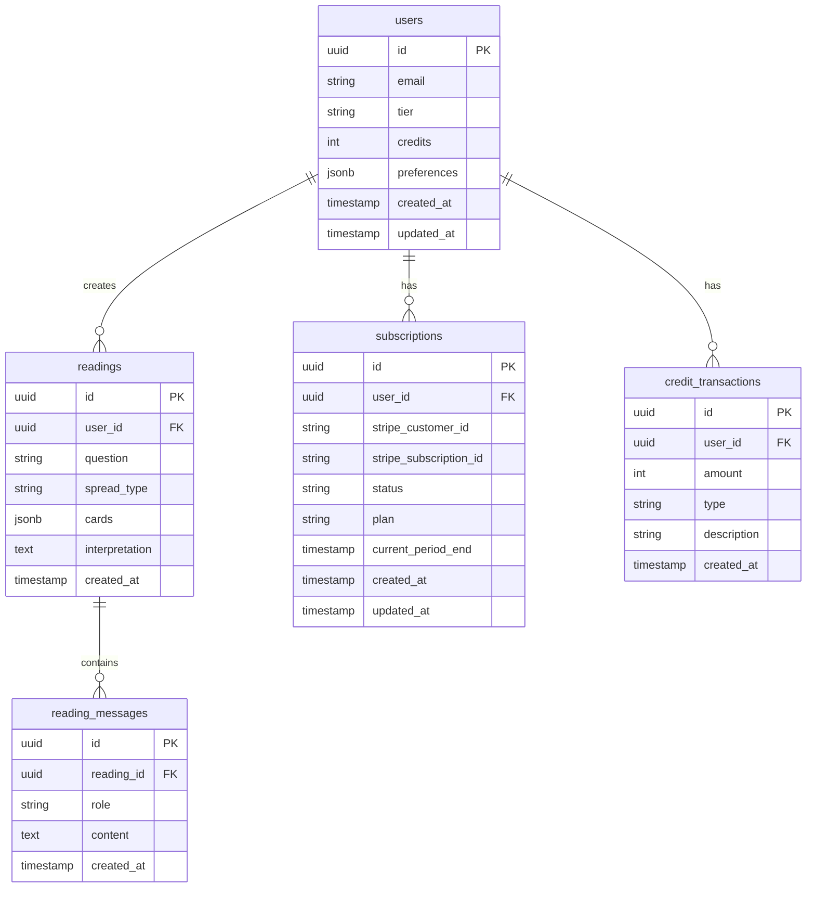

# Data Model

## Overview

Alembic uses Supabase (PostgreSQL) as its primary database. All tables use Row Level Security (RLS) to ensure users can only access their own data.

## Entity Relationship Diagram



## Table Definitions

### users

Extended profile data for Supabase Auth users.

```sql
CREATE TABLE users (
    id UUID PRIMARY KEY REFERENCES auth.users(id) ON DELETE CASCADE,
    email TEXT NOT NULL,
    tier TEXT NOT NULL DEFAULT 'free' CHECK (tier IN ('free', 'seeker', 'initiate')),
    credits INTEGER NOT NULL DEFAULT 3,
    preferences JSONB DEFAULT '{}',
    created_at TIMESTAMPTZ DEFAULT NOW(),
    updated_at TIMESTAMPTZ DEFAULT NOW()
);

-- RLS Policies
ALTER TABLE users ENABLE ROW LEVEL SECURITY;

CREATE POLICY "Users can view own profile"
ON users FOR SELECT
USING (auth.uid() = id);

CREATE POLICY "Users can update own profile"
ON users FOR UPDATE
USING (auth.uid() = id);

-- Trigger for updated_at
CREATE TRIGGER update_users_updated_at
    BEFORE UPDATE ON users
    FOR EACH ROW
    EXECUTE FUNCTION update_updated_at_column();
```

**Fields:**

| Field | Type | Description |
|-------|------|-------------|
| id | UUID | References Supabase Auth user |
| email | TEXT | User's email (denormalized for convenience) |
| tier | TEXT | Subscription tier: free, seeker, initiate |
| credits | INTEGER | Available reading credits |
| preferences | JSONB | User preferences (marketing opt-in, etc.) |
| created_at | TIMESTAMPTZ | Account creation time |
| updated_at | TIMESTAMPTZ | Last profile update |

### readings

Stores completed tarot readings.

```sql
CREATE TABLE readings (
    id UUID PRIMARY KEY DEFAULT gen_random_uuid(),
    user_id UUID NOT NULL REFERENCES users(id) ON DELETE CASCADE,
    question TEXT NOT NULL,
    spread_type TEXT NOT NULL CHECK (spread_type IN ('single', 'three_card', 'shadow_work', 'celtic_cross')),
    cards JSONB NOT NULL,
    interpretation TEXT NOT NULL,
    created_at TIMESTAMPTZ DEFAULT NOW()
);

-- Indexes
CREATE INDEX idx_readings_user_id ON readings(user_id);
CREATE INDEX idx_readings_created_at ON readings(created_at DESC);

-- RLS Policies
ALTER TABLE readings ENABLE ROW LEVEL SECURITY;

CREATE POLICY "Users can view own readings"
ON readings FOR SELECT
USING (auth.uid() = user_id);

CREATE POLICY "Users can create own readings"
ON readings FOR INSERT
WITH CHECK (auth.uid() = user_id);

CREATE POLICY "Users can delete own readings"
ON readings FOR DELETE
USING (auth.uid() = user_id);
```

**Fields:**

| Field | Type | Description |
|-------|------|-------------|
| id | UUID | Unique reading identifier |
| user_id | UUID | Owner of the reading |
| question | TEXT | User's question/focus |
| spread_type | TEXT | Type of spread used |
| cards | JSONB | Array of drawn cards with positions |
| interpretation | TEXT | LLM-generated interpretation |
| created_at | TIMESTAMPTZ | When reading was created |

**Cards JSONB Structure:**

```json
[
  {
    "id": "major_0",
    "name": "The Fool",
    "position": "Past",
    "reversed": false
  },
  {
    "id": "major_1",
    "name": "The Magician",
    "position": "Present",
    "reversed": true
  },
  {
    "id": "cups_ace",
    "name": "Ace of Cups",
    "position": "Future",
    "reversed": false
  }
]
```

### reading_messages

Stores follow-up conversation messages for readings.

```sql
CREATE TABLE reading_messages (
    id UUID PRIMARY KEY DEFAULT gen_random_uuid(),
    reading_id UUID NOT NULL REFERENCES readings(id) ON DELETE CASCADE,
    role TEXT NOT NULL CHECK (role IN ('user', 'assistant')),
    content TEXT NOT NULL,
    created_at TIMESTAMPTZ DEFAULT NOW()
);

-- Indexes
CREATE INDEX idx_reading_messages_reading_id ON reading_messages(reading_id);

-- RLS Policies
ALTER TABLE reading_messages ENABLE ROW LEVEL SECURITY;

CREATE POLICY "Users can view messages for own readings"
ON reading_messages FOR SELECT
USING (
    EXISTS (
        SELECT 1 FROM readings
        WHERE readings.id = reading_messages.reading_id
        AND readings.user_id = auth.uid()
    )
);

CREATE POLICY "Users can create messages for own readings"
ON reading_messages FOR INSERT
WITH CHECK (
    EXISTS (
        SELECT 1 FROM readings
        WHERE readings.id = reading_messages.reading_id
        AND readings.user_id = auth.uid()
    )
);
```

### subscriptions

Tracks Stripe subscription status.

```sql
CREATE TABLE subscriptions (
    id UUID PRIMARY KEY DEFAULT gen_random_uuid(),
    user_id UUID NOT NULL REFERENCES users(id) ON DELETE CASCADE,
    stripe_customer_id TEXT NOT NULL,
    stripe_subscription_id TEXT,
    status TEXT NOT NULL DEFAULT 'inactive' 
        CHECK (status IN ('active', 'canceled', 'past_due', 'inactive')),
    plan TEXT CHECK (plan IN ('seeker', 'initiate')),
    current_period_end TIMESTAMPTZ,
    created_at TIMESTAMPTZ DEFAULT NOW(),
    updated_at TIMESTAMPTZ DEFAULT NOW()
);

-- Indexes
CREATE UNIQUE INDEX idx_subscriptions_user_id ON subscriptions(user_id);
CREATE INDEX idx_subscriptions_stripe_customer_id ON subscriptions(stripe_customer_id);

-- RLS Policies
ALTER TABLE subscriptions ENABLE ROW LEVEL SECURITY;

CREATE POLICY "Users can view own subscription"
ON subscriptions FOR SELECT
USING (auth.uid() = user_id);
```

### credit_transactions

Audit log for credit changes.

```sql
CREATE TABLE credit_transactions (
    id UUID PRIMARY KEY DEFAULT gen_random_uuid(),
    user_id UUID NOT NULL REFERENCES users(id) ON DELETE CASCADE,
    amount INTEGER NOT NULL,
    type TEXT NOT NULL CHECK (type IN ('purchase', 'usage', 'refund', 'bonus')),
    description TEXT,
    created_at TIMESTAMPTZ DEFAULT NOW()
);

-- Indexes
CREATE INDEX idx_credit_transactions_user_id ON credit_transactions(user_id);

-- RLS Policies
ALTER TABLE credit_transactions ENABLE ROW LEVEL SECURITY;

CREATE POLICY "Users can view own transactions"
ON credit_transactions FOR SELECT
USING (auth.uid() = user_id);
```

## Helper Functions

### Update timestamp trigger

```sql
CREATE OR REPLACE FUNCTION update_updated_at_column()
RETURNS TRIGGER AS $$
BEGIN
    NEW.updated_at = NOW();
    RETURN NEW;
END;
$$ LANGUAGE plpgsql;
```

### Deduct credits function

```sql
CREATE OR REPLACE FUNCTION deduct_credits(
    p_user_id UUID,
    p_amount INTEGER,
    p_description TEXT
) RETURNS BOOLEAN AS $$
DECLARE
    v_current_credits INTEGER;
BEGIN
    -- Get current credits with lock
    SELECT credits INTO v_current_credits
    FROM users
    WHERE id = p_user_id
    FOR UPDATE;
    
    -- Check sufficient credits
    IF v_current_credits < p_amount THEN
        RETURN FALSE;
    END IF;
    
    -- Deduct credits
    UPDATE users
    SET credits = credits - p_amount
    WHERE id = p_user_id;
    
    -- Log transaction
    INSERT INTO credit_transactions (user_id, amount, type, description)
    VALUES (p_user_id, -p_amount, 'usage', p_description);
    
    RETURN TRUE;
END;
$$ LANGUAGE plpgsql;
```

## Data Retention

| Data Type | Retention Period | Cleanup Method |
|-----------|------------------|----------------|
| Free user readings | 30 days | Scheduled job |
| Paid user readings | 2 years | Manual or on account deletion |
| Credit transactions | 7 years | Manual (tax records) |
| Security logs | 1 year | Scheduled job |

## Migration Strategy

Migrations are managed with Alembic (the Python library, sharing a name with our project).

```bash
# Create migration
alembic revision --autogenerate -m "description"

# Apply migrations
alembic upgrade head

# Rollback
alembic downgrade -1
```

## Backup Strategy

- **Automatic**: Supabase daily backups (retained 7 days on free tier)
- **Manual**: Weekly pg_dump to secure storage
- **Point-in-time**: Available on Supabase Pro plan

