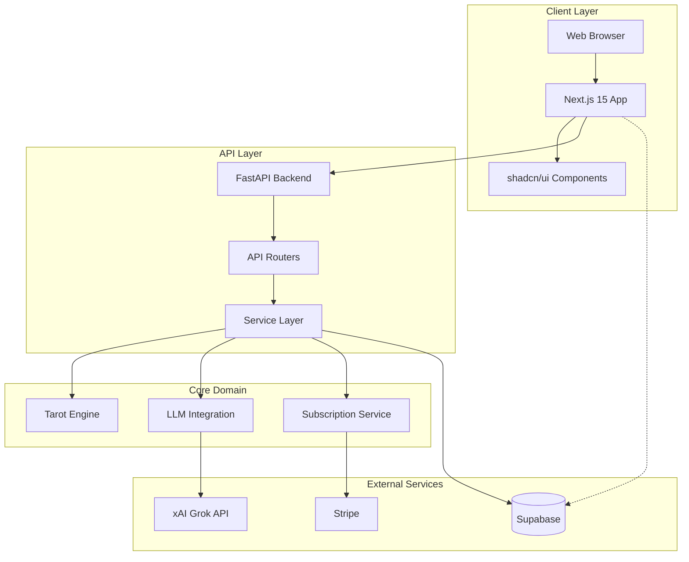
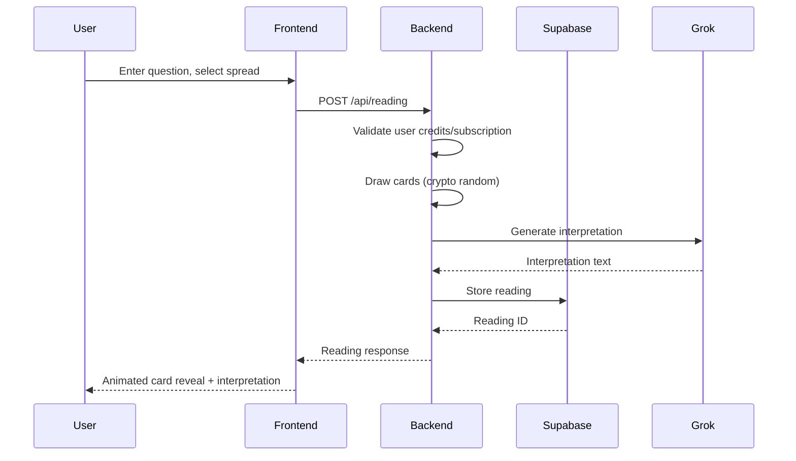
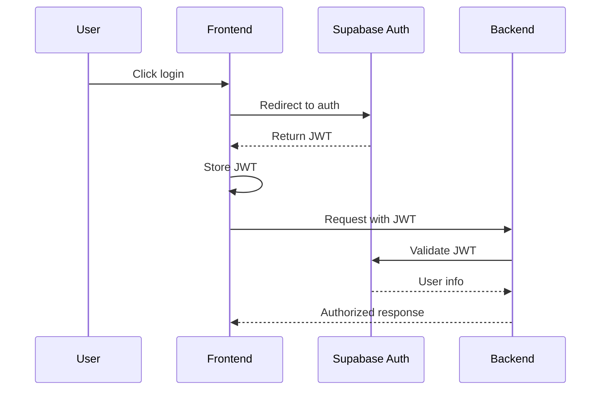
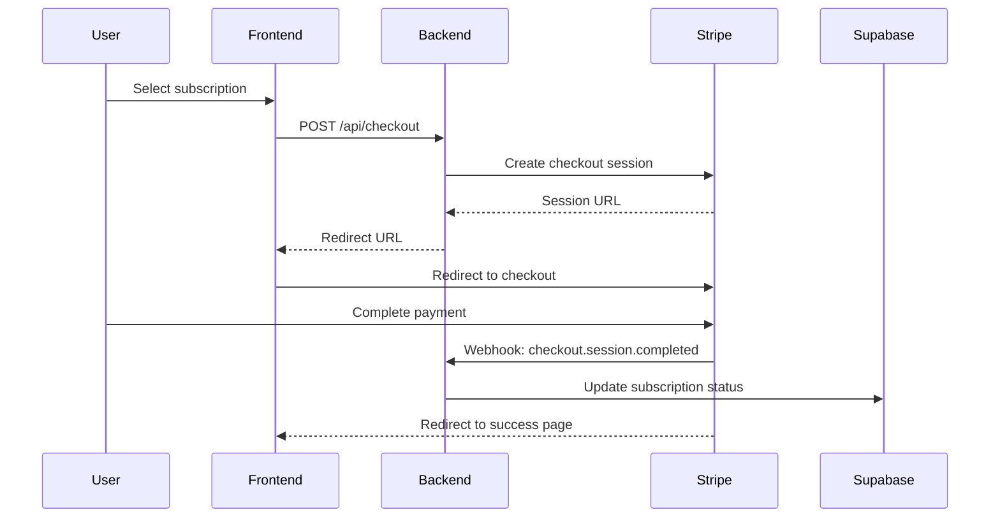

# System Overview

## Vision

Alembic is a Hermetic AI-powered tarot reading application that serves as a digital vessel of transformation. Users engage with tarot not for fortune-telling, but for psychological insight and self-reflection, guided by principles of Hermetic philosophy and depth psychology.

## Architecture Diagram

## Component Responsibilities

### Frontend (Next.js 15)

| Component | Responsibility |
|-----------|---------------|
| `app/page.tsx` | Landing page with marketing content |
| `app/reading/page.tsx` | Main reading interface |
| `app/history/page.tsx` | User's reading history |
| `app/pricing/page.tsx` | Subscription tiers and checkout |
| `components/tarot/` | Card display, spread layouts, animations |
| `components/ui/` | shadcn/ui base components |
| `lib/api.ts` | Backend API client |
| `lib/supabase.ts` | Supabase client for auth |

### Backend (FastAPI)

| Component | Responsibility |
|-----------|---------------|
| `app/main.py` | Application entry point, middleware |
| `app/api/routers/reading.py` | Reading creation and retrieval endpoints |
| `app/api/routers/chat.py` | Follow-up conversation endpoints |
| `app/api/routers/user.py` | User profile and data export |
| `app/api/routers/webhook.py` | Stripe webhook handlers |
| `app/core/tarot/` | Deck, cards, spreads business logic |
| `app/core/llm/` | Grok integration and prompt management |
| `app/core/services/` | Business logic orchestration |

### External Services

| Service | Purpose | Integration |
|---------|---------|-------------|
| **Supabase** | Auth, database, storage | Direct from frontend (auth), via backend (data) |
| **xAI Grok** | LLM interpretations | Via LiteLLM in backend |
| **Stripe** | Payment processing | Checkout from frontend, webhooks to backend |

## Data Flow

### Reading Creation Flow

### Authentication Flow

### Payment Flow

## Security Architecture

### Authentication

- **Provider**: Supabase Auth
- **Method**: JWT tokens
- **Session**: Refresh token rotation
- **MFA**: Optional for users

### Authorization

- **Row Level Security**: All database tables
- **Ownership checks**: Backend verifies user owns resources
- **Rate limiting**: Per-endpoint limits

### Data Protection

- **Encryption at rest**: Supabase default
- **Encryption in transit**: HTTPS everywhere
- **Secrets**: Environment variables only
- **Payment data**: Never touches our servers (Stripe Elements)

## Scalability Considerations

### Current Architecture (MVP)

- Single Vercel deployment (auto-scaling)
- Single Railway instance (can scale vertically)
- Supabase managed PostgreSQL (connection pooling)
- Grok API (rate limited by provider)

### Future Scaling

- **Database**: Read replicas if needed
- **Caching**: Redis for session/response caching
- **CDN**: Vercel Edge for static assets
- **LLM**: Response caching for common patterns

## Monitoring

- **Error tracking**: Sentry
- **Uptime**: External monitoring service
- **Logs**: Structured JSON, Railway log aggregation
- **Metrics**: Custom dashboards for business metrics

## Disaster Recovery

- **Database backups**: Supabase automatic daily
- **Code**: Git repository (GitHub)
- **Secrets**: Documented in secure location
- **Recovery time**: < 1 hour for full restoration

