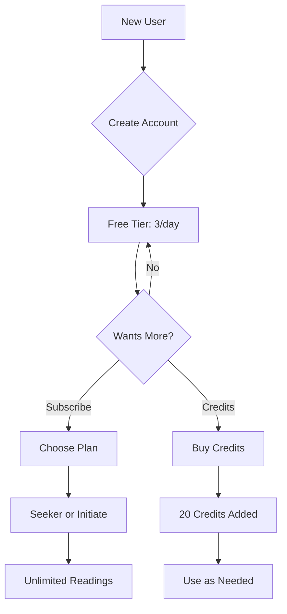

# ADR-003: Monetization Model

## Status

Accepted

## Date

16-12-2025

## Context

Alembic needs a sustainable revenue model that:
- Allows users to try the product before paying
- Provides predictable recurring revenue
- Offers flexibility for different usage patterns
- Remains simple to implement and maintain
- Aligns with the spiritual/wellness market expectations

## Decision

Implement a **hybrid freemium model** with subscriptions and credit purchases.

### Tier Structure

| Tier | Price | Readings | Spreads | History | Features |
|------|-------|----------|---------|---------|----------|
| **Free** | $0 | 3/day | Three-card only | 30 days | Basic |
| **Seeker** | $7/mo | Unlimited | All | 30 days | Follow-up chat |
| **Initiate** | $15/mo | Unlimited | All | Unlimited | Export, priority |
| **Credits** | $5/20 | Pay-per-use | All | 30 days | Flexible |

### Revenue Projections (Conservative)

| Month | Free Users | Paid Users | MRR |
|-------|------------|------------|-----|
| 1 | 500 | 10 (2%) | $100 |
| 3 | 2,000 | 50 (2.5%) | $500 |
| 6 | 5,000 | 150 (3%) | $1,500 |
| 12 | 15,000 | 500 (3.3%) | $5,000 |

### Unit Economics

| Metric | Value |
|--------|-------|
| LLM cost per reading | ~$0.002 |
| Readings per paid user/month | ~30 |
| Cost per paid user/month | ~$0.06 |
| Gross margin | ~99% |

## Alternatives Considered

### Pure Subscription (No Free Tier)

- Pros: Simpler, higher commitment users
- Cons: High barrier to entry, limits growth
- Decision: Rejected - free tier essential for discovery

### Pure Credit System

- Pros: Simple, pay-per-use fairness
- Cons: Unpredictable revenue, user anxiety about spending
- Decision: Rejected as primary model, kept as option

### Ad-Supported Free Tier

- Pros: Monetize free users
- Cons: Degrades experience, misaligned with spiritual positioning
- Decision: Rejected - doesn't fit the brand

### Higher Pricing ($15/$30)

- Pros: Higher revenue per user
- Cons: Smaller market, wellness apps typically cheaper
- Decision: Rejected - $7 sweet spot for spiritual apps

## Implementation

### Stripe Products

```
Products:
- Seeker Monthly: $7/month (price_seeker_monthly)
- Initiate Monthly: $15/month (price_initiate_monthly)
- Credit Pack 20: $5 one-time (price_credits_20)
```

### User Flow



### Credit Deduction Logic

```python
async def can_create_reading(user: User, spread_type: SpreadType) -> bool:
    # Subscribers have unlimited
    if user.tier in ('seeker', 'initiate'):
        return True
    
    # Check daily limit for free tier
    if user.tier == 'free':
        today_count = await get_readings_today(user.id)
        if today_count < 3:
            return True
    
    # Check credits
    credit_cost = get_credit_cost(spread_type)
    return user.credits >= credit_cost

def get_credit_cost(spread_type: SpreadType) -> int:
    costs = {
        SpreadType.SINGLE: 1,
        SpreadType.THREE_CARD: 1,
        SpreadType.SHADOW_WORK: 2,
        SpreadType.CELTIC_CROSS: 3,
    }
    return costs.get(spread_type, 1)
```

## Consequences

### Positive

1. **Low Barrier**: Free tier allows discovery
2. **Recurring Revenue**: Subscriptions provide predictability
3. **Flexibility**: Credits serve occasional users
4. **Simple Pricing**: Easy to understand
5. **High Margin**: LLM costs are minimal

### Negative

1. **Free User Costs**: Infrastructure for non-paying users
2. **Complexity**: Multiple paths to access (sub vs credits)
3. **Churn Risk**: Low price means easy cancellation
4. **Feature Gating**: Must decide what's free vs paid

### Neutral

1. **Market Standard**: Similar to competitors
2. **Room to Grow**: Can add annual plans, higher tiers later
3. **A/B Testing**: Can test pricing over time

## Success Metrics

| Metric | Target |
|--------|--------|
| Free to paid conversion | > 3% |
| Monthly churn rate | < 10% |
| Average revenue per user | > $8 |
| Customer lifetime value | > $50 |

## Future Considerations

1. **Annual Plans**: 20% discount for annual commitment
2. **Team/Family Plans**: Shared subscription
3. **Lifetime Deal**: One-time purchase for early supporters
4. **Premium Features**: Voice readings, custom spreads

